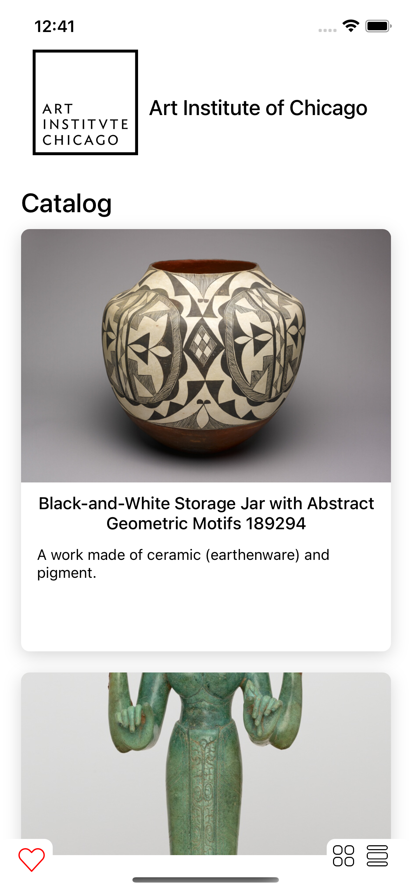

  <h3 align="center">README</h3>

  <p align="center">
   Art Institute Of Chicago Catalog App
    <br />
</div>


<!-- ABOUT THE PROJECT -->
## About The Project




Art Institute Of Chicago Catalog App is a mobile application that allows a user to browse the catalog of artworks exhibited by the Art Institute of Chicago API.

https://api.artic.edu/docs/#introduction

The user can see a thumbnail and a small description of each piece of art on the main screen of the application. Clicking on a thumbnail sends the user to a detailed artwork screen containing a higher quality image and more detailed information about the piece and author. The user can save some favorite artworks and can browse them even after the app is fully closed and reopened.


### Built With

* [![React Native][React Native]][React-url]


<!-- GETTING STARTED -->

### Installation


1. Clone the repo
   ```sh
   git clone https://github.com/francisco0522/PruebaModak.git
   ```
3. Install NPM packages
   ```sh
   npm install
   ```

4. Install pods
   ```sh
   cd ios/ && pod install
   ```
   
5. Run the app
   ```sh
   npx react-native run-ios
   ```
   
   ```sh
   npx react-native run-android
   ```


<!-- CONTACT -->
## Contact

Francisco Londoño -  fran.londono22@gmail.com

Project Link: [https://www.linkedin.com/in/francisco-londoño/](https://www.linkedin.com/in/francisco-londoño/)


<!-- https://www.markdownguide.org/basic-syntax/#reference-style-links -->
[contributors-shield]: https://img.shields.io/github/contributors/othneildrew/Best-README-Template.svg?style=for-the-badge
[contributors-url]: https://github.com/othneildrew/Best-README-Template/graphs/contributors
[forks-shield]: https://img.shields.io/github/forks/othneildrew/Best-README-Template.svg?style=for-the-badge
[forks-url]: https://github.com/othneildrew/Best-README-Template/network/members
[stars-shield]: https://img.shields.io/github/stars/othneildrew/Best-README-Template.svg?style=for-the-badge
[stars-url]: https://github.com/othneildrew/Best-README-Template/stargazers
[issues-shield]: https://img.shields.io/github/issues/othneildrew/Best-README-Template.svg?style=for-the-badge
[issues-url]: https://github.com/othneildrew/Best-README-Template/issues
[license-shield]: https://img.shields.io/github/license/othneildrew/Best-README-Template.svg?style=for-the-badge
[license-url]: https://github.com/othneildrew/Best-README-Template/blob/master/LICENSE.txt
[linkedin-shield]: https://img.shields.io/badge/-LinkedIn-black.svg?style=for-the-badge&logo=linkedin&colorB=555
[linkedin-url]: https://linkedin.com/in/othneildrew
[React Native]: https://img.shields.io/badge/React-Native-20232A?style=for-the-badge&logo=react&logoColor=61DAFB
[React-url]: https://reactnative.dev
